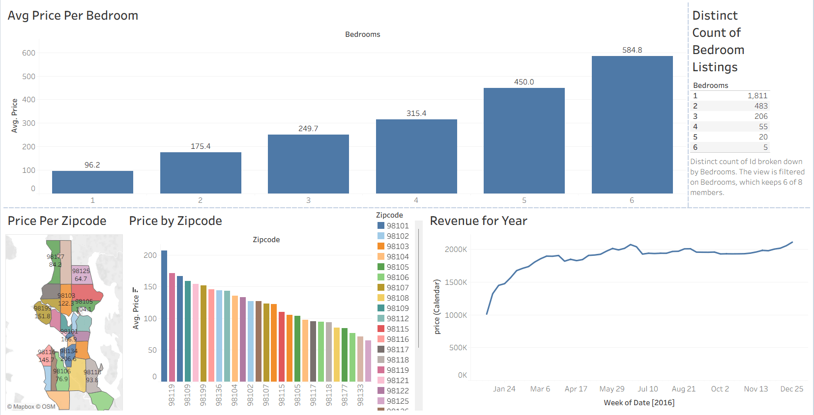

# Real Estate Market Performance Dashboard (Tableau)

## Project Overview
This Business Intelligence project utilizes Tableau to analyze real estate listing data, identifying pricing trends, spatial distributions, and calendar revenue patterns. The workflow involved aggregating regional property data, cleaning geographical zip codes, and building a dynamic executive dashboard to optimize real estate investment decisions.

## Dashboard Preview

## Core Analytical Insights
Based on the visualizations, several prominent market trends stand out across the listings:

### 1. Property Size Valuation (Avg Price Per Bedroom)
* There is a clear linear relationship between bedroom count and listing price.
* **1-Bedroom** properties average around **$96.2**, whereas **6-Bedroom** listings command a premium average price of **$584.8**.
* The inventory volume peaks drastically at 1-Bedroom properties (**1,811 distinct listings**) and steadily decreases down to just **5 listings** for 6-Bedroom properties.

### 2. Spatial Revenue Distribution (Price Per Zipcode)
* The interactive map visualization reveals high-value clusters across specific regional zones.
* **Zipcode 98119** commands the highest pricing tier (averaging near $200), closely followed by **98109**, making them prime neighborhoods for luxury or high-yield investments.
* Peripheral zip codes drop significantly, highlighting a hyper-localized real estate market.

### 3. Annual Market Velocity (Revenue for Year)
* The temporal line chart tracks total market value over the calendar weeks of 2016.
* The market experienced a massive, rapid growth phase between **January and mid-March**, jumping from roughly $1,000K to peaking near $1,900K.
* For the remainder of the year (Spring through Winter), revenue leveled off and remained highly stable around the **$1,900K - $2,000K plateau**.

## Technical Skills Demonstrated
* **Geographical Mapping:** Utilizing Mapbox integration to layer spatial pricing attributes across specific postal boundaries.
* **Dual-Axis and Metric Sorting:** Custom sorting on complex multi-attribute bar charts (Zipcodes) for quick high-to-low visual scanning.
* **Time-Series Analysis:** Formatting continuous date fields to track and forecast revenue plateaus across a fiscal calendar.

## Live Interactive Dashboard
👉 [Click here to view and interact with the live dashboard on Tableau Public]([https://public.tableau.com/app/profile/sabeeka.zaidi/viz/Book1_17847155244840/Dashboard1]
